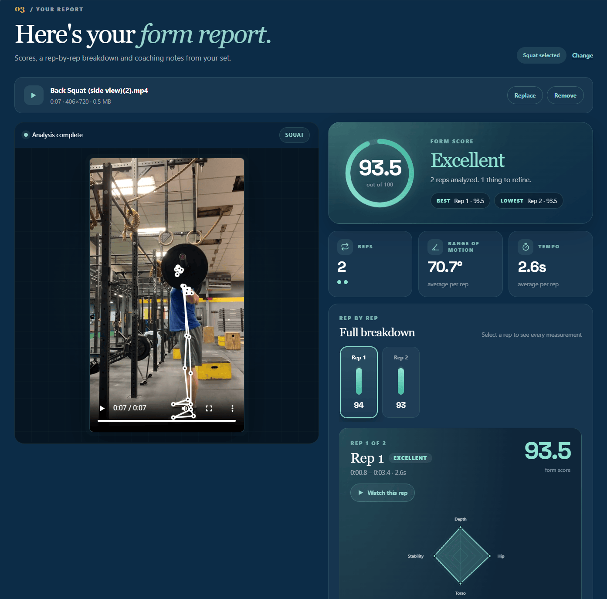
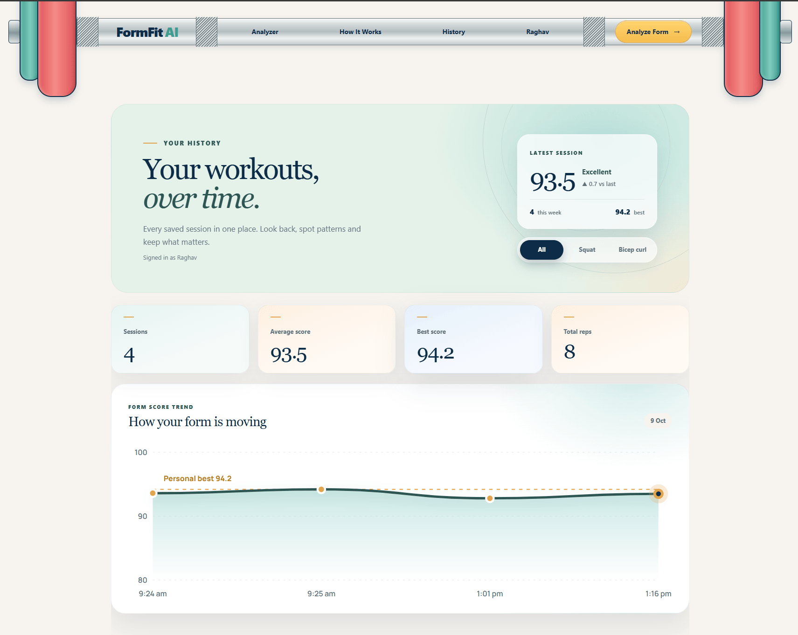
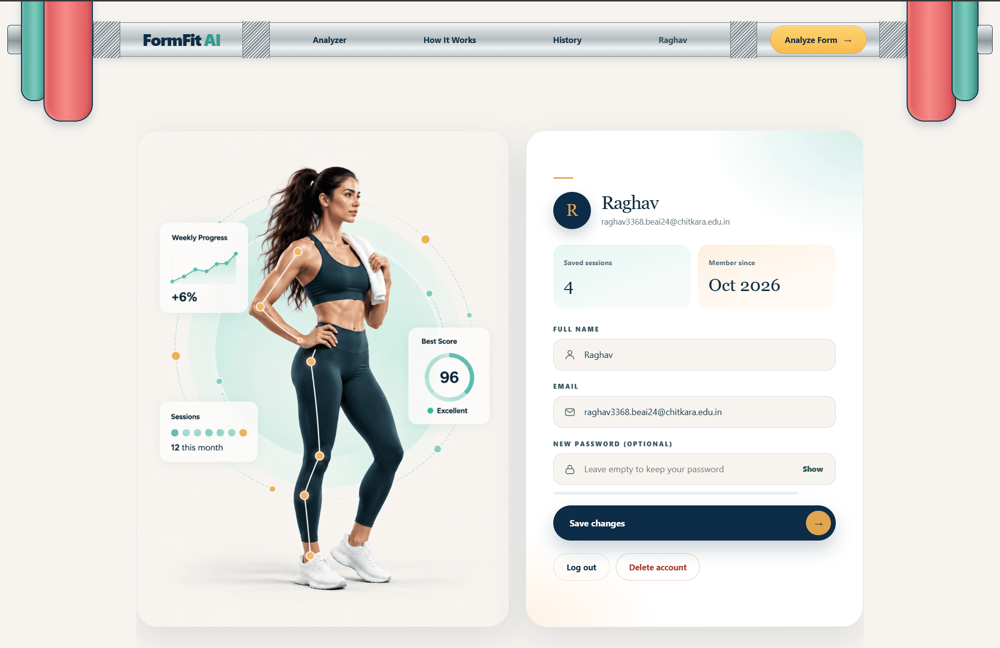
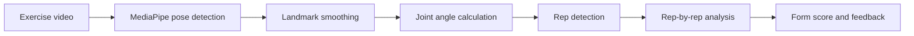

<div align="center">

# FormFit AI

### AI-powered exercise form analyzer

*Upload a workout video and get rep-by-rep feedback on your technique, right in your browser.*

<br>


<br>

[**Live demo**](https://raghavkansal-07.github.io/formfit-ai/) &nbsp;|&nbsp; [**Features**](#features) &nbsp;|&nbsp; [**Run locally**](#running-locally) &nbsp;|&nbsp; [**Guidelines checklist**](#guidelines-checklist)

</div>

---

## Table of Contents

1. [About the Project](#about-the-project)
2. [Features](#features)
3. [Screenshots](#screenshots)
4. [How It Works](#how-it-works)
5. [How Scoring Works](#how-scoring-works)
6. [Tech Stack](#tech-stack)
7. [Data Storage](#data-storage)
8. [CRUD Operations](#crud-operations)
9. [Guidelines Checklist](#guidelines-checklist)
10. [Pages](#pages)
11. [Project Structure](#project-structure)
12. [Running Locally](#running-locally)
13. [Responsive Design](#responsive-design)
14. [Limitations](#limitations)
15. [Author](#author)

---

## About the Project

When exercising without a trainer, it is hard to tell whether an exercise is being done with proper technique.

**FormFit AI** is a web application that analyzes recorded exercise videos using computer vision and pose estimation. It detects each repetition and evaluates:

- **Range of motion**
- **Body and joint stability**
- **Posture**
- **Movement tempo**
- **Exercise-specific form**

Currently supported exercises: **squats** and **bicep curls**.

> **Privacy:** all analysis runs in your browser. Your videos are never uploaded anywhere.

---

## Features

| | Feature | Details |
|---|---|---|
| 🎥 | **Video analysis** | Upload a side-view video and get a form score, rep count, range of motion and tempo |
| 🔍 | **Rep-by-rep breakdown** | Radar chart, score bars, tempo split, joint measurements and coach notes for every rep, plus a "Watch this rep" playback |
| 💾 | **Save workouts** | Save any analysis to your history with one click |
| 📈 | **History page** | Summary stats, a form-score trend chart, an exercise filter, and edit and delete for each session |
| 👤 | **Accounts** | Sign up, log in with an optional "Remember me", edit your profile, log out and delete your account |
| 🧑‍🤝‍🧑 | **Guest mode** | Analyze and save workouts without an account; they move into your account when you sign up or log in |
| 🔔 | **Pop-up messages** | Friendly confirmations after saving changes, logging in and logging out |
| 📱 | **Responsive design** | Layouts for mobile, tablet and desktop |

---

## Screenshots

<table>
  <tr>
    <td align="center"><br><b>Home</b></td>
    <td align="center"><br><b>Analyzer results</b></td>
  </tr>
  <tr>
    <td align="center"><br><b>History</b></td>
    <td align="center"><br><b>Account</b></td>
  </tr>
</table>

---

## How It Works



1. The user uploads an exercise video.
2. The video is processed frame by frame.
3. MediaPipe Pose Landmarker detects body landmarks.
4. Landmark data is smoothed to reduce frame-to-frame noise.
5. Joint angles and movement information are calculated.
6. Exercise-specific logic detects completed repetitions.
7. Each detected repetition is analyzed.
8. A form score and feedback are generated.

---

## How Scoring Works

Each repetition receives a **form score from 0 to 100**. The overall score is the average of all reps.

**Squat**

| Component | Weight | What it measures |
|---|---|---|
| Depth | 45% | Knee angle and how far the hips descend, relative to thigh length |
| Torso control | 25% | Forward lean of the torso |
| Hip position | 15% | Hip angle through the movement |
| Bottom stability | 15% | How steady the knee angle stays at the bottom of the rep |

**Bicep curl** is scored on elbow stability, torso control, total range of motion and tempo.

| Score | Verdict |
|---|---|
| 90 and above | Excellent |
| 75 to 89 | Good |
| 60 to 74 | Fair |
| Below 60 | Needs work |

---

## Tech Stack

| Layer | Technology |
|---|---|
| Markup | HTML5 |
| Styling | CSS3: custom properties, Flexbox, Grid, media queries, animations |
| Logic | Vanilla JavaScript: ES modules, async/await |
| Pose estimation | MediaPipe Pose Landmarker (runs in the browser) |
| Passwords | Web Crypto API: PBKDF2, SHA-256, random salt |

No frameworks or build tools are used.

---

## Data Storage

| Storage type | Name | Used for |
|---|---|---|
| **IndexedDB** | `formfit-db` → `workouts` | Saved workouts: scores, reps, measurements, notes |
| **localStorage** | `ff_users` | User accounts (name, email, salted password hash) |
| **localStorage** | `ff_settings` | History exercise filter |
| **Cookie** | `ff_session` | Login session: 7 days with "Remember me", otherwise until the browser closes |
| **sessionStorage** | `ff_flash` | One-time pop-up message passed between pages |

---

## CRUD Operations

**Workouts (IndexedDB)**

| Operation | Where |
|---|---|
| **Create** | "Save workout" button on the analyzer results |
| **Read** | History page: stats, trend chart and session list |
| **Update** | History page: edit a session's title and notes |
| **Delete** | History page: delete a session, with confirmation |

**User accounts (localStorage + cookie)**

| Operation | Where |
|---|---|
| **Create** | Signup page |
| **Read** | Login page |
| **Update** | Account page: edit name, email or password |
| **Delete** | Account page: delete account (type `DELETE` to confirm) |

---

## Guidelines Checklist

| Requirement | Status | Where |
|---|---|---|
| HTML, CSS and JavaScript tech stack | ✅ | No frameworks; plain HTML, CSS and JS modules |
| Features covered in class | ✅ | DOM manipulation, events, forms and validation, Flexbox, Grid, media queries, animations, async/await, ES modules |
| Responsive for mobile, tablet and desktop | ✅ | Breakpoints at about 1200px, 950px and 600px |
| At least 2 pages | ✅ | Home, History, Login, Signup and Account |
| Web storage, cookie and IndexedDB | ✅ | See [Data Storage](#data-storage) |
| CRUD operations | ✅ | See [CRUD Operations](#crud-operations) |
| Code on GitHub with commits on different days | ✅ | See the repository's commit history |
| Project details in README.md (Markdown) | ✅ | This file |

---

## Pages

| Page | Purpose |
|---|---|
| `index.html` | Landing page and the video analyzer |
| `history.html` | Saved workouts, stats and trend chart |
| `login.html` | Log in |
| `signup.html` | Create an account |
| `account.html` | Profile, log out and delete account |

---

## Project Structure

<details>
<summary><b>Click to expand the folder tree</b></summary>

```text
FitnessAI/
├── index.html           # Landing page + analyzer
├── history.html         # Workout history
├── login.html           # Log in
├── signup.html          # Sign up
├── account.html         # Account page
├── style.css            # Main styles
├── history.css          # History page styles
├── auth.css             # Login / signup / account styles
├── script.js            # Analyzer controller
├── state.js             # Shared analyzer state
├── constants.js
├── db.js                # IndexedDB, localStorage and cookie layer
├── history.js           # History page logic
├── auth.js              # Login / signup / account logic
├── nav-auth.js          # Navbar login state + pop-up messages
├── core/                # Pose model setup, video processing, drawing
├── detection/           # Rep detection and side-view check
├── analysis/            # Per-rep form analysis
├── geometry/            # Angle calculation
├── landmarks/           # Landmark smoothing
├── models/              # MediaPipe pose model
└── assets/              # Images
```

</details>

---

## Running Locally

The project uses ES modules and cookies, so it **must be served over HTTP**. Opening `index.html` directly from the file system will not work.

**Option 1: VS Code**

1. Install the *Live Server* extension.
2. Right-click `index.html` and choose **Open with Live Server**.

**Option 2: Python**

```bash
python -m http.server 5500
```

Then open `http://localhost:5500`.

---

## Responsive Design

The layout adapts at three main breakpoints (about 1200px, 950px and 600px). On smaller screens the navbar collapses into a menu, card grids stack, and the login and signup artwork is hidden.

---

## Limitations

- Accounts are stored in the browser only, so they are **not secure** and are not shared between devices. A real product would use a server.
- Clearing site data deletes saved workouts and accounts.
- Analysis works best with a clear **side-view** video where the whole body is visible.
- Only squats and bicep curls are supported; other exercises on the page are marked "Coming soon".
- The numbers shown in the home-page previews are sample data.

---

## Author

**Raghav Kansal**  
GitHub: [@RaghavKansal-07](https://github.com/RaghavKansal-07)

Pose estimation is powered by [MediaPipe](https://developers.google.com/mediapipe) from Google.

## License

Released under the [MIT License](LICENSE).

<div align="center">

<br>

*Train with more awareness.*

</div>